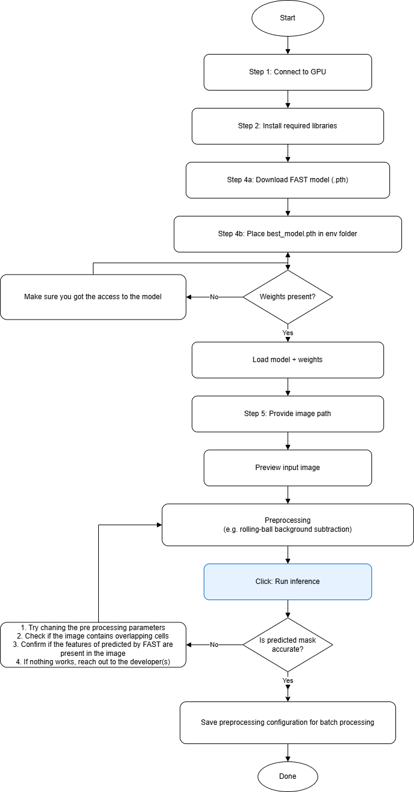
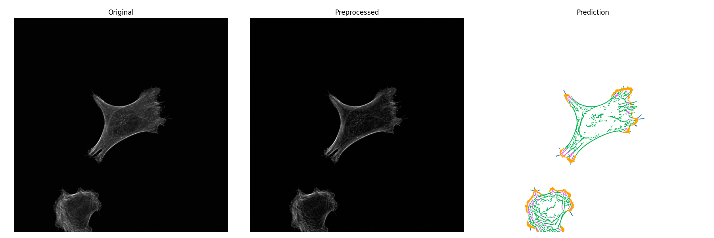

# FAST: Filamentous Actin Segmentation Tool for cell cytoskeleton quantification 

## Description

This repo contains implimentation of FAST. It is assumed that the user has collected images using confocal microscopy with relevant immunostaining (like phalloidin). Currently, the app is expected to return images with an overlay of different cytoskeletal components. Basic familiarity with Python is necessary for using this tool.

## Table of Contents

- [Installation](#installation)
- [FAST testing](#fast-testing)
- [Contributing](#contributing)
- [License](#license)
- [Contact](#contact)

## Installation

Please make sure you have all the required Python packages to run this app. A computer with GPU is preferred but this might also run on CPUs (not tested).  
 
The missing packages can be installed using `pip install -r requirements.txt`

## FAST testing

Please check custom dataset using Google colab notebook `inference_demo.ipynb` to confirm if FAST is approporiate prior to batch inference. 

Refer to the following workflow   

If the analysis is finished successfuly it will load the image on your browser something like this for the `test.tif` for background radius 50 
 
**Note:** you might have to change the values of thresholds like background subtraction radius to suit your data

## Contributing

This project is still being developed and we would love to have contributions from the users both in the form of suggestions under (`Issues` and `Discussions` sections) and `Pull requests`.

## License

This project is licensed under the [MIT License](LICENSE).

## Contact

If you have questions or want to contribute to the project, contact:

- Vineeth Aljapur (mailto:vineethajapur@cmail.carleton.ca)